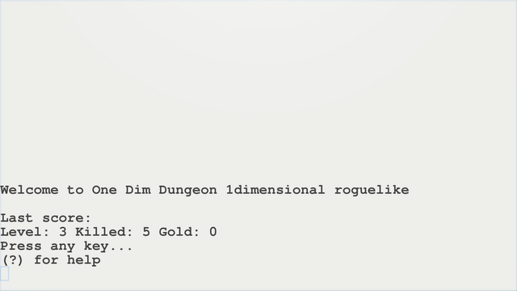

# One Dimension Dungeon

by lee2sman 2020

  

### Dependencies

- node.js
- chalk package (for color)

## To install

Download (or clone) and run ```npm install``` to install chalk via npm 

## To launch

```
node game.js
```

To launch with debug mode on:

```node game.js --debug``` OR ```node game.js -d```

## Controls

You can move with arrows or vim-keys.

```
Motion: LEFT        REST       RIGHT

        h OR ← | . OR (space) | r OR →

Commands:

(?) help (this menu)
(↓) or (<) or (j) descend stairs/retrieve amulet
(q) or (p)        quaff potion
(d)               debug mode toggle on/off
(Q)               Quit
```

## Goal

Collect gold. Descend 16 levels through the dungeon and retrieve the amulet of Yendor. Avoid getting killed.

## About 

I hacked together the original (buggy) version in a day, then took a few days to add features, refactor, and track down annoying bugs. There may still be more!

Can also be modified to work in vertical orientation instead of horizontally.

**Read much more about it (and other 1-dimensional roguelikes and dungeon crawlers) on my Nosebook blog [here](http://leetusman.com/nosebook/one-dimensional-dungeons).**

## Roadmap

Yes, I have ideas on further ways to expand gameplay!

See [ROADMAP](ROADMAP.md)

### License

Copyleft GNU Affero General Public License v3 (AGPL-3.0).
