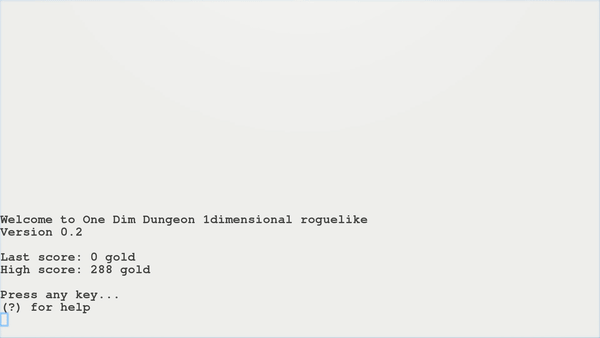

# One Dim Dungeon ("Odd")

by lee2sman 2020 - 2021

  

Odd is an "espresso-break" one-dimensional roguelike dungeon crawler, inspired by Rogue, Brough-likes, and the world of one-dimensional dungeon crawlers.

### Dependencies

- node.js
- chalk package (for color)

## To install

Download (or clone) and run ```npm install``` to install chalk via npm 

## To launch

```
./odd
```

To launch with debug mode on:

```./odd --debug``` OR ```./odd -d```

To launch with vertical orientation:

```./odd --vertical``` OR ```./odd -v```

To launch game in flip-flop mode (orientation switches every level):

```./odd --flip-flop``` OR ```./odd -f```

## Controls

```
Motion:    ARROW KEYS or Vim-keys

Commands:

(?)        help (this menu)
(<)        descend stairs/retrieve amulet
(q) or (p) quaff potion
(d)        debug mode toggle on/off
(v         toggle horizontal/vertical orientation
(Q)        Quit
```

## Goal

Collect gold. Descend 16 levels through the dungeon and retrieve the amulet of Yendor. Avoid getting killed.

## Potions

#### Good 
- Regeneration 
- Health potion
- Potion of luck

#### Bad 
- Cloak of darkness 
- Poison
- Summon demon

#### Who knows?
- Dissolving dust
- Hallucination

## About 

I hacked together the original (buggy) version in a day, then took a few days to add features, refactor, and track down annoying bugs. There may still be more!

You can now also change the orientation!

**Read much more about it (and other 1-dimensional roguelikes and dungeon crawlers) on my Nosebook blog [here](http://leetusman.com/nosebook/one-dimensional-dungeons).**

## Bugs

Have ideas or thoughts on bugs or portability or mechanics? File an issue, or get in touch via [my website](https://leetusman.com).

## Roadmap

See [ROADMAP](ROADMAP.md)

### License

Copyleft GNU Affero General Public License v3 (AGPL-3.0).
